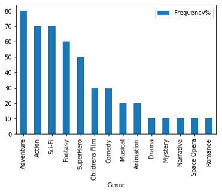
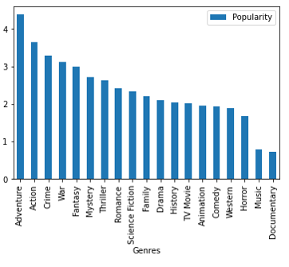
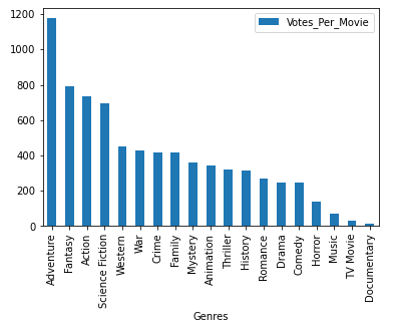
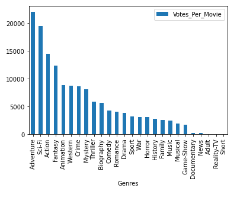

# Microsoft Movie Studios Analysis

**Author**: [Blake Elieff](mailto:blakeelieff@hotmail.com)

## Overview

This project determines what type of films Microsoft's new movie studio should be creating. I have used data from multiple sources to come to a conclusion and have used visual elements to assist in conveying my findings. Microsoft can use my analysis to ensure they are producing the correct type of films.

## Business Problem


Microsoft Movie Studios are looking to start producing films but require guidance on what type to make. Without this analysis, Microsoft may produce films that are not going to be popular or profitable. Using my sourced data, i have determined which types of movies are the most profitable and popular so that Microsoft is able to start producing.

## Data

5 datasets were used. These are: TMDB.movies, IMDB.basics, IMDB.ratings, BOM.movie_gross, TN.movie_budgets

## Methods

In this project i grouped the datasets into financial and popularity. I then determined what genres of film are the most profitable, have the highest gross and then what is the most popular.

## Results

The results from the financial data show that in the top 10 grossing films; Adventure is the most frequently occuring genre. Followed by Action and Sci-Fi



The results from the financial data also show that in the top 10 profiting films, Action occurs the most frequently followed by Adventure and Sci-Fi


The results from TMDB for popularity show that Adventure is the most popular, hence achieves the greatest quantity of votes per movie

 

The results from IMDB for the popularity data show that Adventure achieves the most votes followed by Sci-Fi and Action



## Conclusions

This analysis leads to one recommenation for Microsoft:

- **Microsoft should produce films with the folllowing genres:** Adventure, Action Sci-Fi

## For More Information

See the full analysis in the [Jupyter Notebook](./Microsoft_Movie_Studios_Analysis.ipynb) or review this [presentation](./Microsoft_Movie_Studios_Presentation.pdf).

For additional info, contact Blake Elieff at [blakeelieff@hotmail.com](mailto:blakeelieff@hotmail.com)

## Repository Structure

```
├── images
├── zippedData
├── README.md
├── Microsoft_Movie_Studios_Analysis.ipynb
└── Microsoft_Movie_Studios_Presentation.pdf
```
